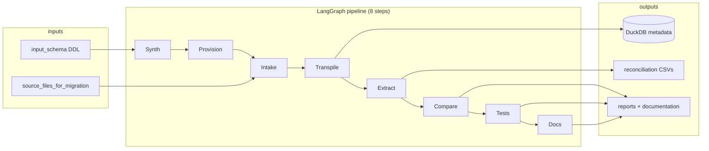

# Migration Accelerator

**Enterprise migration, simplified.** An AI-assisted workbench for moving SQL workloads from legacy warehouses to modern cloud platforms — with synthetic test data, LLM transpilation, live reconciliation, regression tests, and auto-generated documentation.

The default and fully supported path is **Teradata → BigQuery**. Other source/target pairs can be selected for transpilation, but live provisioning and reconciliation today only run for Teradata → BigQuery.

---

## What this project does

You drop Teradata (or other) SQL files into a folder, run the pipeline, and the accelerator:

1. **Generates synthetic data** from DDL in `src/input_schema/`
2. **Provisions** source (Teradata) and target (BigQuery) schemas with that data
3. **Transpiles** each migration SQL file using Claude (Data Engineer + Data Manager validation loop)
4. **Reconciles** by executing source and target SQL and comparing result CSVs
5. **Runs regression tests** and writes a markdown report
6. **Generates documentation** — portfolio overview, lineage, and per-run migration docs

Everything is orchestrated as a **sequential LangGraph agent pipeline** and exposed through a **React + FastAPI web UI**, CLI commands, or an optional legacy Gradio app.



---

## Pipeline at a glance

| Step | UI label | What happens |
|------|----------|--------------|
| 1 | **Synth** | Build synthetic CSVs from `src/input_schema/` (dialect follows selected source) |
| 2 | **Provision** | Load data into Teradata + BigQuery shared datasets |
| 3 | **Intake** | Read all SQL files from `src/source_files_for_migration/` |
| 4 | **Transpile** | LLM converts each file to target SQL; validates up to 3 attempts |
| 5 | **Extract** | Run source & target SQL; export CSVs per run |
| 6 | **Compare** | Diff CSVs; optional LLM root-cause analysis |
| 7 | **Tests** | Regression suite; optional LLM failure analysis |
| 8 | **Docs** | `documentation/` overview, lineage, per-run markdown |

Steps marked **AI** in the UI use Claude when **LLM agents** is enabled: Transpile (always), Compare, Tests (on failures), and Docs.

---

## Prerequisites

- **Python 3.12+** and [uv](https://docs.astral.sh/uv/)
- **Node.js 18+** (for the React UI)
- **Anthropic API key** (for transpilation and optional analysis)
- **Teradata** credentials (live provision + recon source)
- **Google Cloud / BigQuery** project (live provision + recon target)

---

## Quick start

### 1. Install dependencies

```bash
uv sync
cd frontend && npm install
```

### 2. Configure environment

```bash
cp .env.example .env
```

Minimum variables to fill in:

| Variable | Purpose |
|----------|---------|
| `ANTHROPIC_API_KEY` | Claude API for transpile + optional analysis |
| `TD_HOST`, `TD_USER`, `TD_PASSWORD`, `TD_DATABASE` | Teradata connection |
| `GCP_PROJECT_ID` | BigQuery project |
| `GCP_SOURCE_DATASET` / `GCP_TARGET_DATASET` | Shared recon datasets |

See `.env.example` for the full list.

### 3. Add migration SQL

Place one `.sql` file per query in:

```
src/source_files_for_migration/
```

The repo ships with six sample ecommerce analytics queries.

### 4. Run the web UI

**Windows (one command):**

```powershell
.\scripts\dev.ps1
```

Then open **http://127.0.0.1:5173**

**Manual (any OS):**

```bash
# Terminal 1 — API on http://127.0.0.1:8000
uv run python -m api

# Terminal 2 — React dev server on http://127.0.0.1:5173
cd frontend && npm run dev -- --host 127.0.0.1
```

**Production (single server):**

```bash
cd frontend && npm run build
uv run python -m api
# Open http://127.0.0.1:8000
```

### 5. Run the full pipeline from the UI

1. Choose **source** and **target** in the migration route bar (Teradata → BigQuery for live recon).
2. Click **Full** (or run individual presets: Provision, Migrate, Reconcile, Tests, Docs).
3. Watch the **migration stream** and **event feed** for progress.
4. Open **Reports** for reconciliation, regression, and documentation artifacts.

Use the **Settings** gear to toggle LLM agents and skip flags.

---

## CLI usage

### Full agent pipeline (recommended)

```bash
uv run python -m agents
uv run python -m agents --list-agents
```

Useful flags:

```bash
uv run python -m agents --no-llm              # disable Claude (transpile will not work)
uv run python -m agents --skip-synthetic      # skip data generation
uv run python -m agents --skip-provision      # skip Teradata/BQ load
uv run python -m agents --skip-migrate        # reuse existing metadata runs
uv run python -m agents --skip-recon
uv run python -m agents --skip-tests
uv run python -m agents --skip-docs
uv run python -m agents --integration --slow  # include integration/slow tests
```

Report written to `test_results/agent_pipeline_report.md`.

### Interactive transpiler only

```bash
uv run python -m accelarator.migration_assistant.translator
```

Reads `src/source_files_for_migration/`, writes transpiled SQL to `src/target_files_migration/`.

### Individual stages

```bash
# Synthetic data from DDL
uv run python scripts/generate_synthetic_data.py

# Teradata table setup
uv run python scripts/init_teradata_source.py

# Reconciliation (interactive or batch)
uv run python -m reconciliation.migration_recon
uv run python scripts/run_recon_all.py
uv run python -m reconciliation.compare_results

# Regression tests
uv run python -m test_generator
uv run python -m test_generator --integration --slow

# Documentation
uv run python -m documentation
```

### Utilities

```bash
uv run python scripts/test_teradata_connection.py
uv run python scripts/clear_metadata.py
```

---

## Web UI features

| Area | Description |
|------|-------------|
| **Migration route** | Pick source/target; run pipeline presets next to target selector |
| **Migration stream** | Live 8-step flow from source warehouse to target lakehouse |
| **Event feed** | Streaming agent activity from the pipeline |
| **Metrics rail** | Env status, run counts, recent migrations |
| **AI Copilot** | Chat: ask questions or trigger pipeline commands |
| **SQL Studio** | Transpile individual files on demand |
| **Reports** | View reconciliation, regression, and documentation markdown |

---

## Supported databases

| Role | Options in UI | Live provision + recon |
|------|---------------|------------------------|
| **Source** | Teradata, Oracle, SQL Server, Netezza, PostgreSQL, MySQL | **Teradata only** |
| **Target** | BigQuery, Snowflake, Redshift, Azure Synapse, Spark, PostgreSQL | **BigQuery only** |

Other pairs use the transpiler with dialect-aware prompts; synthetic data DDL follows the selected source dialect.

---

## Project structure

```
migration-accelerator/
├── frontend/                     # React + Vite UI
├── src/
│   ├── accelarator/              # Core: LLM, GCP, metadata, data gen, transpiler
│   ├── agents/                   # LangGraph pipeline + chat service
│   ├── api/                      # FastAPI REST + SSE streaming
│   ├── reconciliation/           # Schema provision, query export, compare, reports
│   ├── test_generator/           # Regression test suite
│   ├── documentation/            # Doc + lineage generator
│   ├── input_schema/             # Base table DDL (Teradata)
│   └── source_files_for_migration/   # Input migration SQL files
├── scripts/                      # Dev launcher, synthetic data, recon helpers
├── docker/                       # Optional local Teradata compose
├── docs/                         # Human-written reference (e.g. test catalog)
├── metadata/                     # DuckDB run history (gitignored)
├── reconciliation/               # Recon CSV exports + reports (gitignored)
├── test_results/                 # Pipeline + regression reports (gitignored)
├── documentation/                # Generated migration docs (gitignored)
├── credentials/                  # GCP service account JSON (gitignored)
└── app.py                        # Legacy Gradio UI (deprecated)
```

---

## Key outputs

| Path | Contents |
|------|----------|
| `metadata/accelerator.duckdb` | Run history: source SQL, generated SQL, recon flags |
| `src/target_files_migration/` | Transpiled target SQL files |
| `src/synthetic_data_gen/` | Generated CSVs per table |
| `reconciliation/source_results/{run_id}/` | Teradata query CSV exports |
| `reconciliation/target_results/{run_id}/` | BigQuery query CSV exports |
| `reconciliation/reconciliation_report.md` | Pass/fail summary + analysis |
| `test_results/regression_report.md` | Test suite results |
| `documentation/migration_overview.md` | Portfolio summary |
| `documentation/lineage.md` / `lineage.json` | Table lineage across runs |
| `documentation/migrations/run_*.md` | Per-query migration detail |

---

## How transpilation works

For each SQL file the **MigrationTranspiler** agent:

1. Sends source SQL to Claude (**Data Engineer**) with target-dialect instructions
2. Validates output with Claude (**Data Manager**) for semantic equivalence and dialect correctness
3. Retries up to **3 times** with validation feedback
4. Persists the result to DuckDB metadata and writes target SQL to disk

This is sequential — one file at a time. Large portfolios (e.g. 100 queries) will run for a long time and consume significant API quota.

---

## Scaling notes

- There is **no file-count limit** — all `.sql` files in `source_files_for_migration/` are processed.
- Processing is **sequential** (no parallel transpile or recon).
- Each pipeline re-run **appends** new rows to metadata (no deduplication by filename).
- For large batches, consider running in chunks, disabling LLM on recon/tests if not needed, and clearing old metadata with `scripts/clear_metadata.py`.

---

## Legacy Gradio UI

```bash
uv run python app.py
```

Opens a Gradio interface on an available port (7860+). Prefer the React + FastAPI UI for new work.

---

## License

Internal / project use — see repository settings for license terms.
